# Start Build Container,image and running it
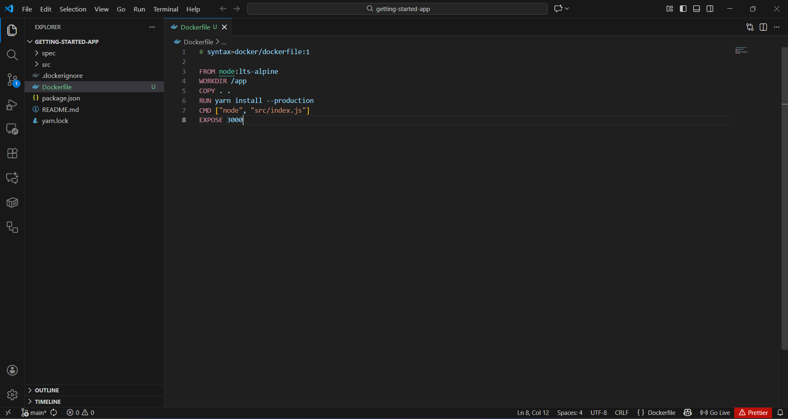
- This image is start to create the Dokcerfile

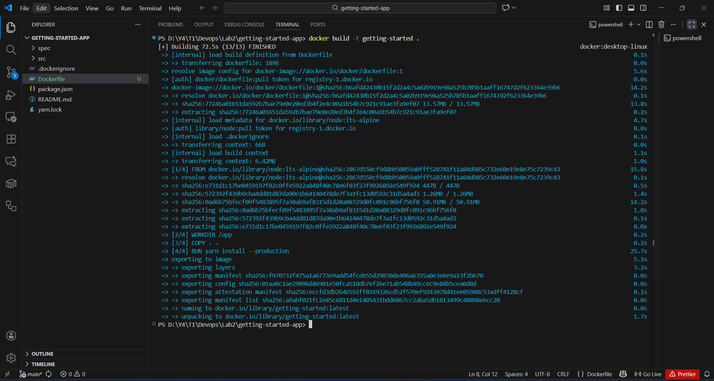
- This image contain the command "docker build -t getting-started ." to install the container and image

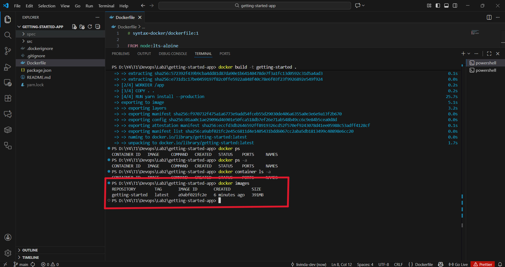
- Image already installed 

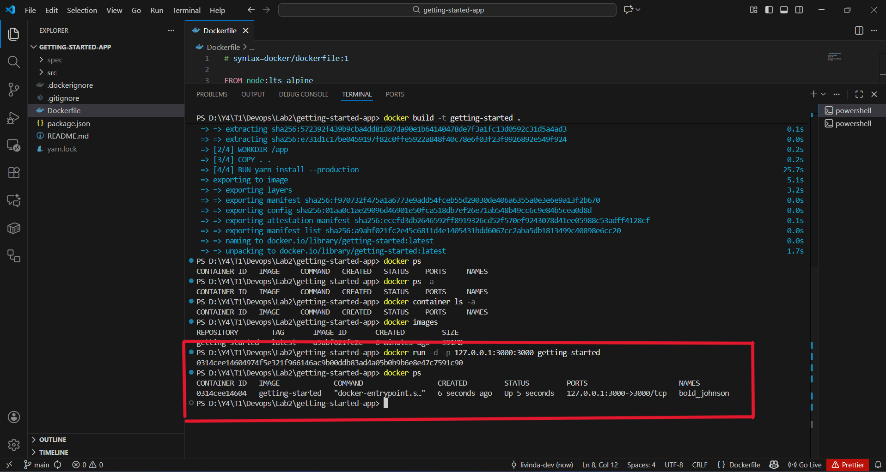
- Container already run with the image "getting-started" on port 3000 and the name of contaner is bold-json

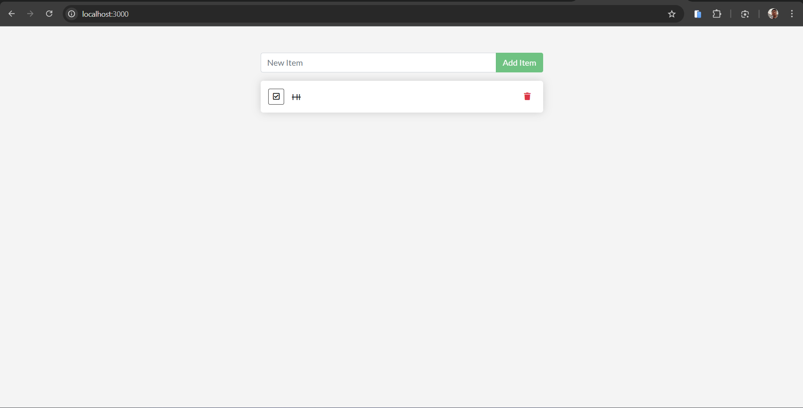
- after run we can test the app in browser

- container in docker desktop

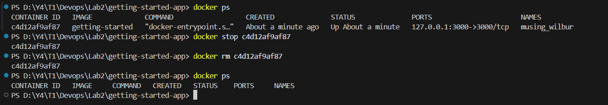
- stop the container

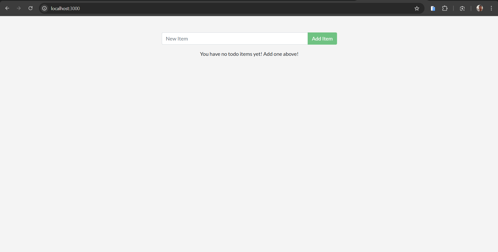
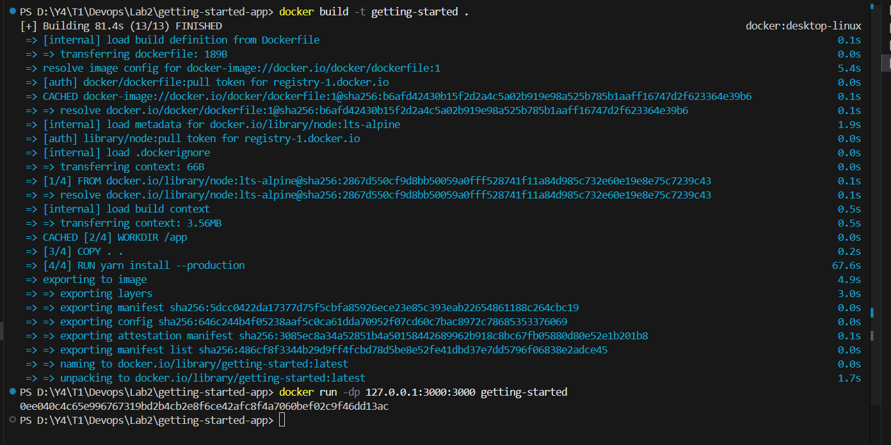
- update image after change the code in app.js

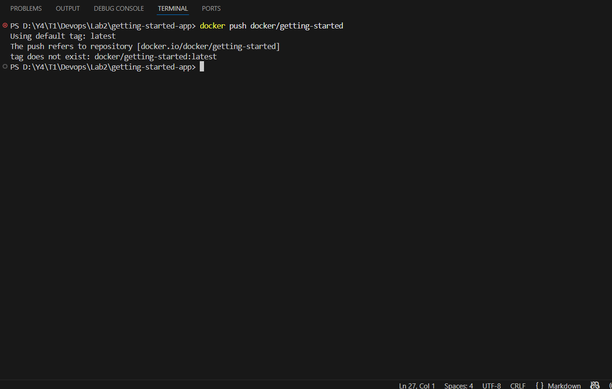
- 

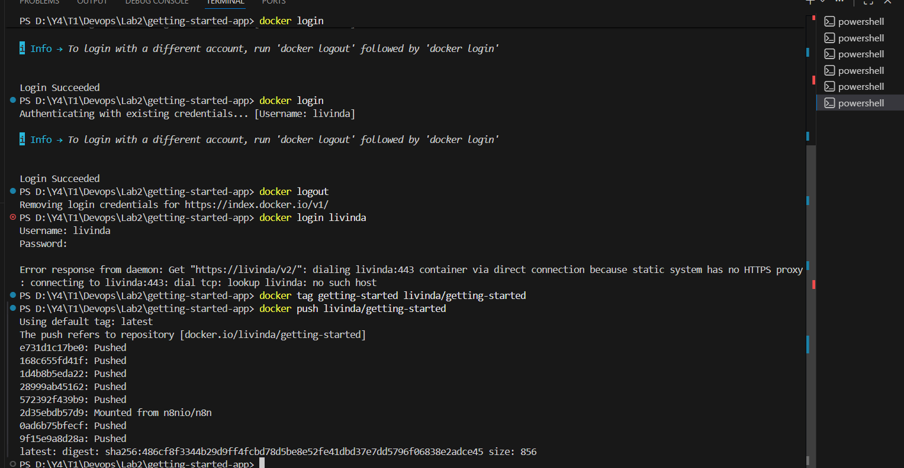
- 

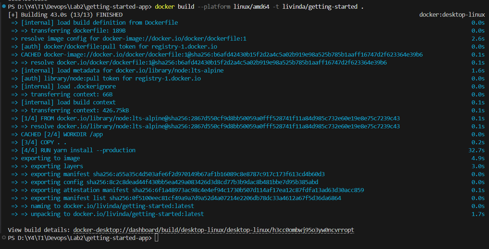
